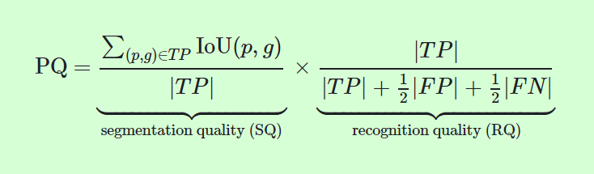
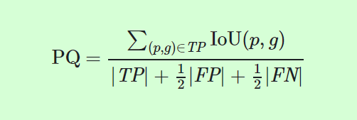
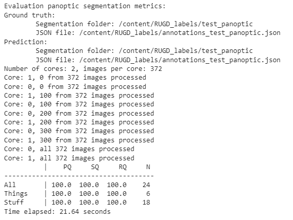

# Panoptic Quality Evaluation

## Overview

In order to assess the performance of our fine-tuned Detectron2 Panoptic Segmentation model on an off-road environment, we will be using the standard "panoptic evaluation metrics" (https://cocodataset.org/#panoptic-eval) used by COCO (Common Objects in Context).

Panoptic Quality (PQ) evaluates the performance for all the defined stuff and things categories in a single metric (whereas previous sematic segmentation or instance segmentation had their own specialized and individual metrics). 

The computation of PQ involves two components: 1) segmentation quality (SQ) and 2) recognition quality (RQ). (Give more details here.)

## Workflow
The code in the python notebook "PanopticQualityWorkflow.ipynb" contains the workflow (WIP) for Panoptic Quality Evaluation of our project. 

The main steps for evaluating our project results are:
1. Run inference on our pre-processed off-road test dataset (RUGD and Rellis-3d) with a baseline Detectron2 panoptic segmentation model (panoptic_fpn_R_50_1x).
2. Create and use a Panoptic Quality Workflow to evaluate the PQ of the baseline model predictions compared to the ground truth.
3. Fine-tune the baseline Detectron2 panoptic segmentation model by training it on our pre-processed off-road training dataset (RUDG and Rellis-3d).
4. Run inference on our pre-processed off-road test dataset with the fine-tuned Detectron2 panoptic segmentation model.
5. Use the Panoptic Quality Workflow to evaluate the PQ of the fine-tuned model predictions compared to the ground truth.
6. Compare the PQ results

Currently, the definitions we use for the "things" and "stuffs" classes (that will be evaluated by PQ) are as follows:
- things: ['pole', 'vehicle', 'log', 'bicycle', 'person', 'picnic-table']
- stuffs: ['void', 'dirt', 'sand', 'grass', 'tree', 'water', 'sky', 'generic-object', 'asphalt', 'gravel', 'building', 'mulch', 'rock-bed', 'fence']

The notebook currently contains exploration of two possible methods to use for our PQ Workflow. 

Panoptic Quality Method 1 consists of using the built-in Detectron2 "COCOPanopticEvaluator" class (https://detectron2.readthedocs.io/en/latest/_modules/detectron2/evaluation/panoptic_evaluation.html) to do both inference and evaluation on our test dataset. This requires our test dataset to be registered with the correct metadata information. COCOPanopticEvaluator uses the COCO Panoptic API Evaluation script (https://github.com/cocodataset/panopticapi) to generate the panoptic quality score of the test dataset (after the inference is done). Current exploration involves setting the necessary metadata information and attempting to run the inference and evaluation in conjunction with the COCOPanopticEvaluator on our test dataset using the baseline Detectron2 model (steps 1 and 2). The current issue with this involves a mismatch in the pre-defined things/stuff categories and our own definition of things/stuff categories when setting the metadata information. If this can be resolved, we can utilize the COCOPanopticEvaluator within our PQ workflow for steps 1-2 and steps 4-5.

Panoptic Quality Method 2 consists of using the COC Panoptic API Evaluation script (https://github.com/cocodataset/panopticapi) directly to generate the PQ score. In order to utilize this script, we need the ground truth labels (in the correct COCO format) of the test set as well as the inference predictions (in the same COCO format) of the model on the test set. From our pre-processing dataset workflow, we already have the ground truth labels of our test set in the necessary COCO format (which is the PNG labels and JSON annotation file). Current exploration involves trying to reformat the Detectron2 panoptic segmentation model's inference output to receive the predictions of the test dataset in the form of PNG images and JSON annotation file so that we can utilize PanopticAPI. If this can be resolved, we can utilize PanopticAPI for steps 2 and 5 (and the workflow for retrieving the inference outputs in desired format will be for steps 1 and 4).

Test run of Method 2 with ground truth to ground truth comparison (with the PNG images and JSON annotation file) shows an expected 100% PQ score.

